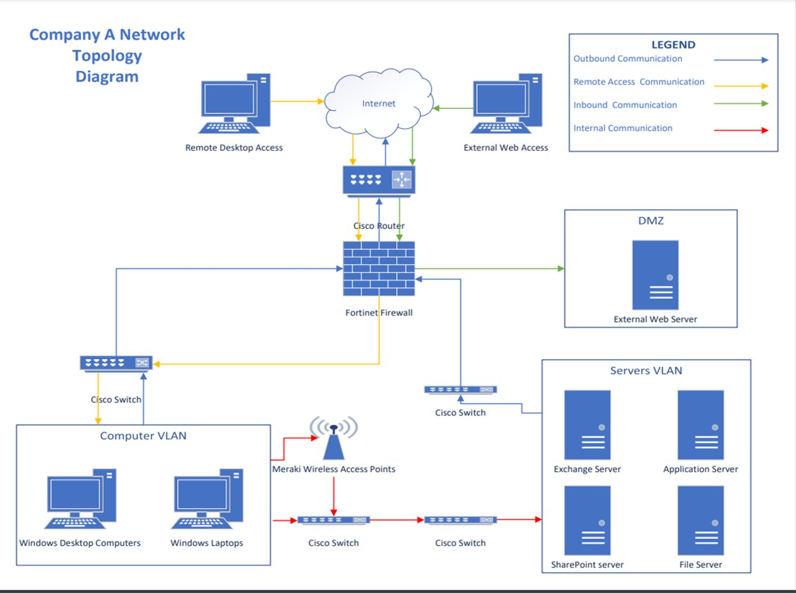
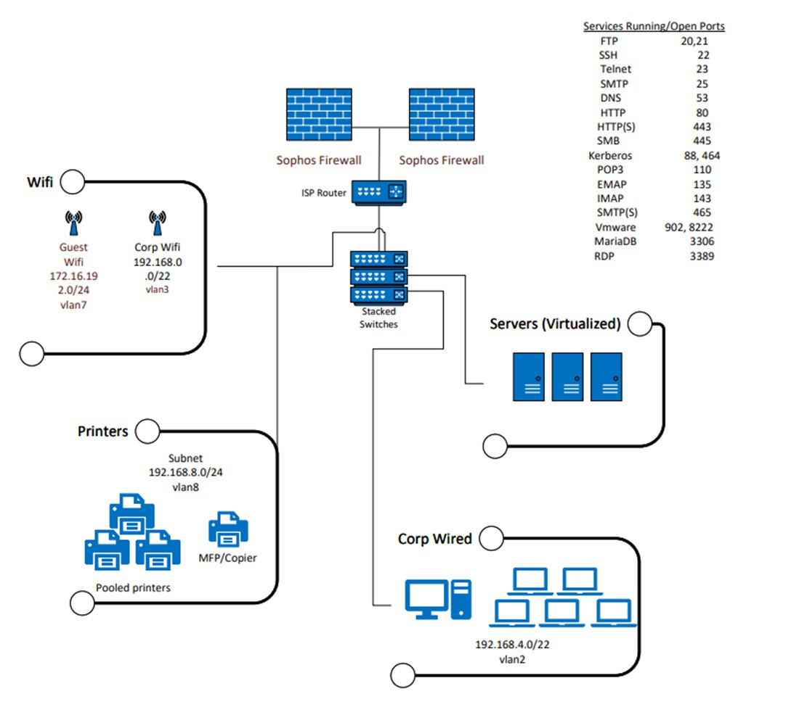
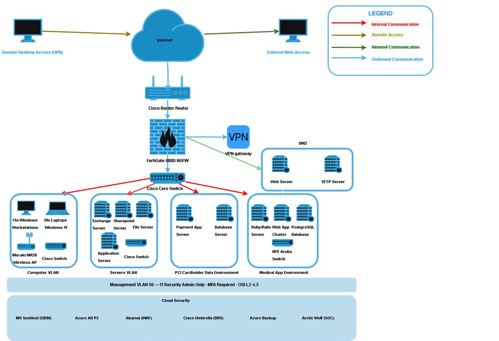

# Corporate Network Security Merger Proposal

> Academic project — Network security design and compliance planning for a simulated corporate merger between two companies with distinct infrastructure environments.

---

## Overview

This project proposes a secure, merged network architecture for two fictional companies (Company A and Company B) with different existing infrastructures, compliance requirements, and security postures. The goal was to identify vulnerabilities, design a hardened unified network, and ensure compliance with industry regulations — all within a $50,000 first-year budget.

---

## Skills Demonstrated

- Vulnerability identification and risk analysis (likelihood, impact, risk rating)
- Network topology design (VLANs, perimeter security, segmentation)
- Zero Trust Architecture implementation
- Defense in Depth strategy
- Regulatory compliance mapping (HIPAA, PCI-DSS v4.0)
- Cloud security tooling (Azure Sentinel SIEM, Azure AD P2, Azure VPN Gateway, Azure Backup)
- Cost-benefit analysis (on-premises vs. cloud vs. hybrid)
- OSI model application to real network components
- Emerging threat analysis (AI phishing, ransomware)

---

## Tools & Technologies

| Category | Tools |
|---|---|
| Firewall / Perimeter | FortiGate 800D NGFW, Cisco Border Router |
| Switching / VLANs | Cisco 3750x Core Switch, HPE Aruba Switch |
| Wireless | Meraki MR28 WAP |
| SIEM | Microsoft Sentinel (Cloud) |
| IAM / MFA | Azure Active Directory P2 |
| Remote Access | Azure VPN Gateway (replaces exposed RDP) |
| Backup / Recovery | Azure Backup |
| DNS / Web Security | Cisco Umbrella |
| Endpoint Protection | Sophos Intercept X, Arctic Wolf |
| Email Security | Mimecast |
| CDN / DDoS | Akamai |
| File Transfer | SFTP (replacing insecure FTP) |

---

## Vulnerabilities Identified & Addressed

### Company A
| Vulnerability | Risk | Mitigation |
|---|---|---|
| RDP (Port 3389) exposed | High | Replaced with Azure VPN Gateway |
| Ports 21–90 open | High | Close unused ports |
| All users have local admin rights | High | RBAC via Azure AD P2 (least privilege) |
| Stale/inactive user accounts | Moderate | Account lifecycle policy + IAM enforcement |
| EOL systems (Windows 7, Server 2012) | High | Replaced with Windows 11 Pro / Server 2019 |

### Company B
| Vulnerability | Risk | Mitigation |
|---|---|---|
| MFA not enforced | High | Enforced via Azure AD P2 |
| PostgreSQL internet-accessible | High | Moved behind firewall, VLAN isolated |
| EOL systems (Windows XP, Server 2012) | High | Replaced with supported OS versions |
| Residential router at perimeter | High | Replaced with Cisco enterprise border router |
| All users have local admin rights | High | RBAC via Azure AD P2 |

---

## Network Diagrams

### Company A — Original Topology

### Company B — Original Topology

### Proposed Merged Network — Final Design

---

## Network Design

The proposed merged network uses **4 segmented VLANs**:

- **Corporate VLAN** — General business operations
- **Financial / Cardholder Data VLAN** — PCI-DSS isolated environment
- **Medical App VLAN** — HIPAA-controlled environment
- **Servers VLAN** — Internal servers, accessible without internet dependency

### Security Design Principles

**Zero Trust Architecture**
- No implicit trust for any user or device
- MFA enforced via Azure AD P2 before network/system access
- VPN required for all remote access (encrypted, authenticated)
- Lateral movement blocked by VLAN segmentation

**Defense in Depth**
- Layer 1: FortiGate NGFW filters malicious traffic at the perimeter
- Layer 2: Cisco Umbrella blocks known malicious domains
- Layer 3: VLAN segmentation contains breaches to one segment
- Layer 4: MS Sentinel provides centralized logging, alerting, and detection

---

## Compliance

### PCI-DSS v4.0
| Requirement | How It's Met |
|---|---|
| Req. 1 — Network isolation | Cardholder data in its own VLAN |
| Req. 4 — Encrypted transmission | SFTP replaces unencrypted FTP |
| Req. 8 — Strong authentication | MFA via Azure AD P2 |
| Req. 10 — Audit logging | MS Sentinel centralized log monitoring |

### HIPAA Security Rule
| Standard | How It's Met |
|---|---|
| Access Control | Medical App VLAN + Azure AD P2 MFA |
| Audit Controls | MS Sentinel log management |
| Transmission Security | SFTP encrypts all medical data in transit |
| Contingency Plan | Azure Backup for disaster recovery |

---

## Cost Analysis

| Approach | Pros | Cons |
|---|---|---|
| On-Premises Only | Low cloud costs, works without internet | Not scalable, high long-term hardware costs |
| Cloud Only | Scalable, vendor-managed | Internet-dependent, costs grow with data volume |
| **Hybrid (Proposed)** | **Reuses existing enterprise hardware, cloud scalability, stays within $50k budget** | **Requires managing both environments** |

### Estimated First-Year Cloud Costs
| Service | Annual Cost |
|---|---|
| Azure VPN Gateway (VPNGw1) | ~$1,668/yr |
| MS Sentinel SIEM | ~$5,000–$8,000/yr |
| Azure AD P2 | ~$14,000–$15,000/yr |
| Azure Backup | ~$3,000–$5,000/yr |
| EOL System Replacements | ~$800–$1,000/system |

---

## Emerging Threats Addressed

1. **AI-Powered Phishing** — MFA and VLAN segmentation limit the blast radius of a successful phish
2. **Ransomware** — VLAN segmentation slows lateral spread; Azure Backup enables recovery; FortiGate NGFW detects and blocks cross-VLAN movement

---

## Project Context

- **Type:** Academic / Coursework
- **Field:** Cybersecurity — Network Security & Compliance
- **Relevant Certifications:** CompTIA Security+, Network+
- **Frameworks Referenced:** NIST SP 800-30, NIST SP 800-207 (Zero Trust), PCI-DSS v4.0, HIPAA Security Rule

---

## Author

William  
Cybersecurity Student | Security+ | Network+  
[LinkedIn](#) • [GitHub](#)

